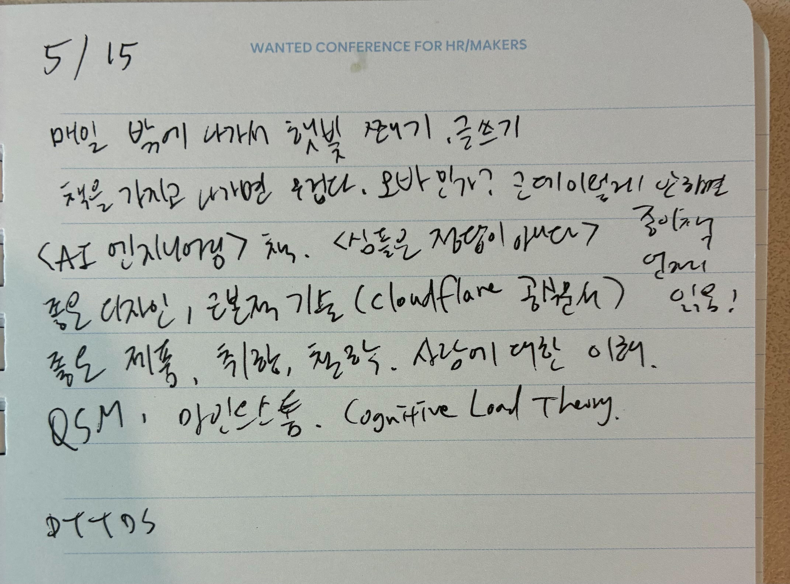
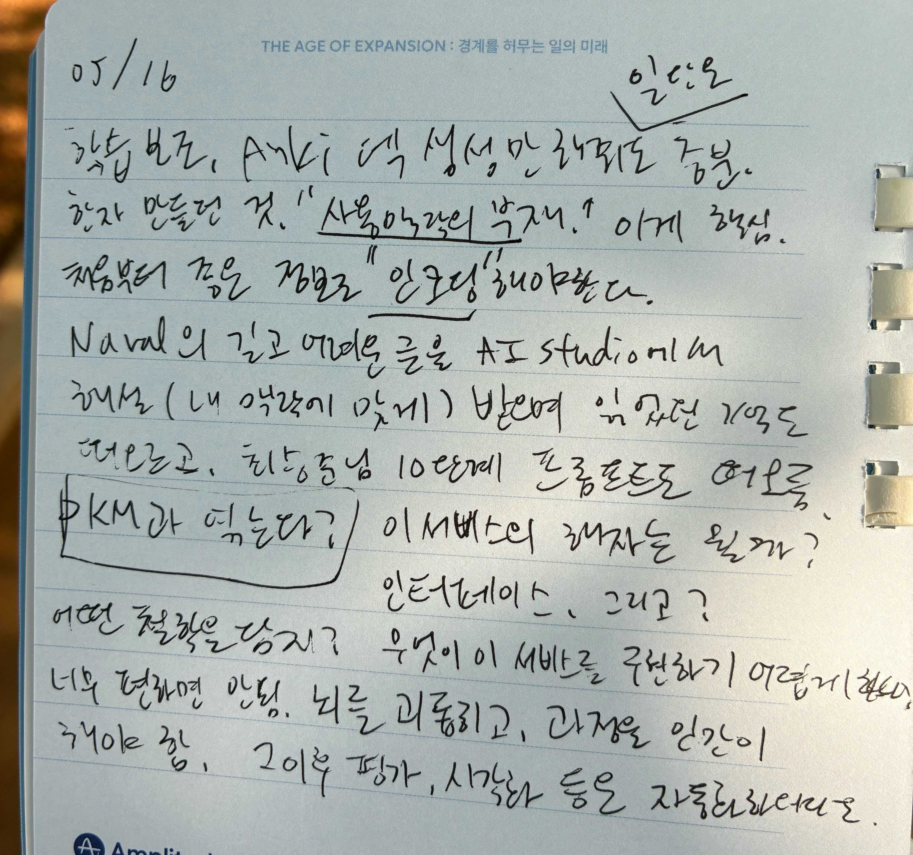
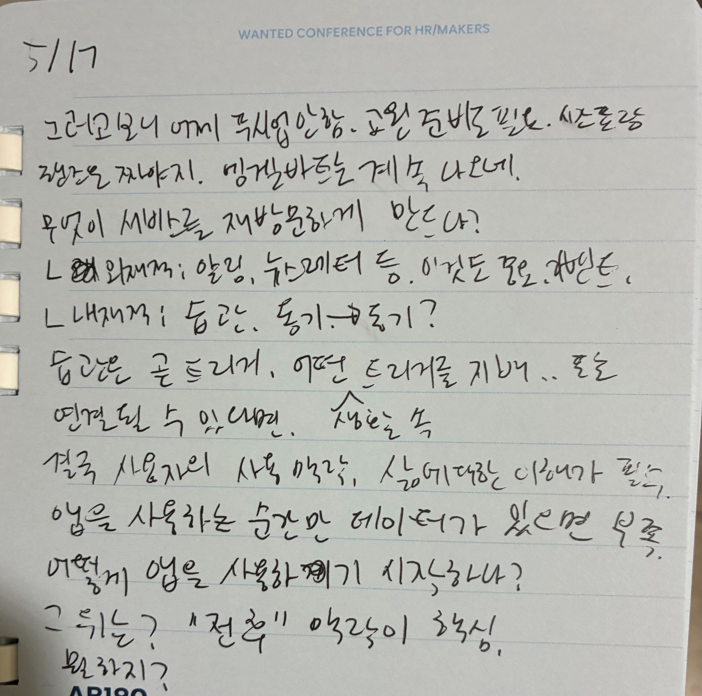

# Slack: c-families habit/context usage frame

> Slack thread archive
> Source: https://corcaai.slack.com/archives/C05J5LTFSCU/p1778805288184149?thread_ts=1778805288.184149
> Resolved thread: C05J5LTFSCU:1778805288.184149
> Requested message: 1778805288.184149
> Last updated: 2026-05-17 15:23

---

**BAE Hwidong** · 2026-05-15 09:34

@private external chat product 앞으로 (평일/주말 상관없이) 30일간 몸과 마음의 건강을 위한 챌린지를 할 거고 이 쓰레드에서 내 기록을 추적할 겁니다.
매일 10:30에 트리거 돌면서, 전날 기록을 이 쓰레드에 올렸는지 체크해서, 안 올렸으면 올리라고 하고, 올렸으면 그 내용에 기반해서 피드백 주세요. 이거 전용 스킬을 만들어도 좋겠네요.
대략 이런 내용을 올릴 겁니다.
• 운동 뭐했나
• 종이책 뭐 읽었나
• 어떤 생각을 하며 손으로 어떤 내용을 썼나
• 그 외 뭐 했나, 느낀점 등

---

**private external chat product** · 2026-05-15 09:34

설정했습니다.  - 전용 스킬: wellness-challenge-checkin - 스케줄: 매일 10:30 KST, 평일/주말 모두 - 대상: 이 쓰레드 - 기간: 2026-05-15 시작, 30일 - 동작:   - 전날 기록이 없으면 부드럽게 기록 요청   - 있으면 운동/종이책/손글씨/느낀점 기반으로 짧게 피드백   - 첫날인 오늘 10:30에는 전날이 챌린지 시작 전이라 조용히 건너뛰도록 했습니다. 첫 실제 체크는 내일 10:30입니다.  검증도 했습니다. - 이벤트 등록 JSON schema 검증 통과 - 현재 쓰레드 스냅샷 기준 helper smoke test 실행 완료  다만 첫 실제 10:30 트리거가 성공적으로 돌고 답글까지 남기는지는 아직 미래 실행이라 미검증입니다.

---

**BAE Hwidong** · 2026-05-15 14:08

5/15
- 오늘 아침은 지난 몇달간, 어쩌면 올해, 아니면 그 이상? 을 통틀어 가장 만족스러운 아침이었다. 05:50 에 알람 듣고 깨서 06:15 에 수첩, 펜, 종이책(AI 엔지니어링) 들고 집을 나섰다. 스트레칭 좀 하고, 햇빛 쬐며 안양천 산책하면서 수첩에 메모 남기고, 책 리드레스하고 1장 읽으며 클로드와 토론.
- 책은 목차 읽으면서 1~4장, 10장이 중요하다는 걸 알게 됐고 LM과 LLM과 파운데이션 모델의 차이가 뭔가? 엔지니어링이 AI에 붙었다는 건 어떤 의미인가? 등을 떠올렸다.
	- Large? 기준이 있다. 파라미터의 크기일텐데 정확히 모르겠음.
	- Foundation? 뭔가의 주춧돌이 된다. 기반이 된다. 뭐의 기반이지?
	- 엔지니어링이 붙으면 어떤 의미? 평가하고 개선한다? 잘 모르겠음.
- 그다음 실제 책 읽었는데 사실 저기까지는 못 갔지만, Model as a service 얘기를 보면서 음 파운데이션이 이 뜻일 수 있겠군 이라는 추측은 했음. 그리고 BERT(masked)가 현재의 대세(auto-regressive)와 어떻게 다른지 설명이 나오는데 이해가 안 가서 클로드와 한참 토론해서 많은 걸 배움. 고객사 컨설팅에 쓸 아이디어도 얻음.
- 중간중간에는 에이전트에게 엥겔바트의 IA 개념을 어떻게 private external chat product에 도입할 수 있을지, 기존의 내가 설계했던 시스템을 어떻게 보완할지 토론 조금 했음. 버그도 고치고.

---

**private external chat product** · 2026-05-15 14:08

좋습니다. 5/15 기록 확인했어요.  오늘 기록에서 특히 좋은 점은 세 가지예요.  - 시작이 선명함: 05:50 기상 → 06:15 외출까지 이어진 게 큽니다. “좋은 하루를 보내야지”가 아니라 몸이 먼저 움직인 구조였네요. - 몸/마음/지성이 같이 열림: 스트레칭, 햇빛, 산책, 손글씨, 종이책, 토론이 한 묶음으로 붙어 있어서 만족감이 컸던 것 같아요. - 읽기가 일로 연결됨: BERT vs auto-regressive, foundation model, model as a service 같은 개념이 고객사 컨설팅 아이디어로 이어진 건 아주 좋은 신호입니다.  가볍게 정리하면 오늘의 핵심은:  > “아침 루틴이 단순한 건강 활동이 아니라, 사고 품질을 올리는 운영체제처럼 작동했다.”  내일은 완벽히 재현하려고 하기보다, 최소 단위만 남겨도 좋겠습니다.  최소 버전 - 밖에 나가기 - 손글씨 한 줄 - 종이책 5분 - 떠오른 질문 하나 적기  오늘은 챌린지 첫 기록으로 꽤 강한 기준점이 생겼네요.

---

**BAE Hwidong** · 2026-05-16 07:16

참고로 이건 어제 종이 메모야.

📎 **Attachments**
- 

---

**private external chat product** · 2026-05-16 07:16

좋아요. 이건 5/15 종이 메모 보조 기록으로 같이 보겠습니다.  사진은 일부가 잘려 있고 글씨 판독이 완전하진 않지만, 핵심은 어제 기록의 “손글씨/생각 정리” 근거로 충분해 보여요.   다음 체크 때는 본문 기록 + 이 종이 메모를 함께 참고하겠습니다.

---

**BAE Hwidong** · 2026-05-16 07:21

# 26-05-16

• 0550 기상. 화장실에 밍기적 + 에이전트 일 시키다가 0625쯤 일어남. 옷입고 책 챙기려다, 책 있으면 무거워서 그냥 집에서 AI 엔지니어링 조금 더 읽음. 읽으면서 떠올린 주요 개념에 대한 질문 메모하고, 대략 1.1.2 마무리 전까지 읽음. "내가 뭐 읽고 있는데 소크라테스식으로 답변해주고, 마지막에는 플래시카드로 테스트해줘" 정도의 지침 넣은 클로드 프로젝트 만들어서 대화 시작.
• 그리고 수첩만 가지고 밖에 나와서 15층까지 계단 한번 오름. 그리고 안양천 산책하며 수첩에 메모.
• 책 읽으며 질문 쓴것들이 새로운 안키 서비스의 시작이 될지도? 질문 쓰고 스스로 답변 쓰는 식으로 하고 있는데 이걸 재사용하고 싶다는 마음이 물씬…
<아래는 책 읽으며 한 메모들>

비지도 학습과 자기지도 학습 차이? -> 전자는 라벨 없음, 후자는 라벨을 생성해낸다?

BOS, EOS - 왜 이런 마커가 중요한가? -> 문장을, 답변을 어딘가에서는 끊을 수 있어야 하니까.

LM과 LLM - 파라미터가 얼마나 커야 대규모인가? -> 그 시대의 평균적 인식에 따름

왜 키우고 싶어하는가? -> 성능을 높이고 싶어서. 모델 성능의 정의는? (각종 벤치마크 - 계속 달라졌음. 벤치마크 해킹도 일어나고. 핵심은 전이? 인간 지능에 대한 평가와 유사하군.. IQ 높으면 일반적으로 더 똑똑하다고 할 수 있지만 그게 전부는 아님) 정확히 왜 키우면 성능이 높아지지?

LLM vs 파운데이션 모델 -> 나는 모델 애즈 어 서비스와 관련 있다고 추측했음. 책은 모델을 다양한 어플리케이션 요구에 맞춰 발전시킬 수 있다는 걸 의미한다고 함. 범용 모델. AGI가 떠오르기도 한다. 그리고 멀티 모달리티를 핵심적으로 이야기하는군. 어플리케이션은 다양한 형태를 요구하고 그걸 단일 모델로 서빙. LLM 이 아닌 LMM.

OpenAI - 자연어 지도란? 멀티모달 학습에 이용. 이 이미지와 이 텍스트가 근처에 있으면 라벨로 볼 수 있지 않을까?

CLIP은 임베딩 모델이다 - 추후 설명한다고. 임베딩 대충 아는데 정확히는 모름. 의미를 벡터라이즈해서 유사한 걸 찾을 수 있게 해준다. “의미”가 뭐지? 임베드. 임베디드 프로그래밍이 급 생각남. 어원은? 차이는?
</메모들>

첨부파일은 수첩 사진찍은 거.

📎 **Attachments**
- 

---

**private external chat product** · 2026-05-16 07:21

5/16 기록 확인했어요.  좋은 점이 아주 선명합니다.  - 어제의 성공 패턴을 작게 반복함: 05:50 기상, 산책, 계단, 손글씨, 종이책. “완벽한 아침”이 아니라 “다시 궤도에 올리는 아침”이 된 게 좋아요. - 읽기가 질문 생산으로 이어짐: 비지도/자기지도, BOS/EOS, LLM/파운데이션 모델, CLIP/임베딩처럼 그냥 이해한 척 넘기기 쉬운 지점에서 멈춘 게 핵심이에요. - 안키 서비스 아이디어의 씨앗: “질문 쓰기 → 스스로 답변 → 재사용하고 싶음”은 꽤 좋은 출발점입니다. 지식관리라기보다 학습 중 생기는 마찰을 제품화하는 느낌이 있어요.  작게 보태면, 오늘 메모의 중심 질문은 이거 같아요.  > “모델은 어떻게 세상의 의미를 학습 가능한 형태로 바꾸는가?”  라벨을 만들고, 토큰 경계를 만들고, 임베딩 공간에 놓고, 멀티모달 신호를 맞추는 것들이 전부 이 질문 주변에 있네요.  내일은 하나만 해도 좋겠습니다.  오늘 쓴 질문 중 딱 1개만 골라서   내 현재 답변 / 책의 답변 / 아직 헷갈리는 점 / 플래시카드 1장   이렇게 바꿔보기.  특히 첫 카드 후보는 이거요.  Q. 비지도 학습과 자기지도 학습의 차이는? A. 둘 다 사람이 붙인 정답 라벨 없이 학습하지만,    자기지도 학습은 데이터 안에서 예측 과제를 만들어 “라벨처럼” 사용한다. 예: 문장의 다음 단어 예측, 이미지 일부 가리기 후 복원.  좋은 아침의 힘이 살짝 재현됐네요. 작은 물길이 생긴 느낌입니다.

---

**BAE Hwidong** · 2026-05-16 07:25

추가 메모: 오늘의 0550 과 0625 사이의 시간을 더 줄일 필요가 있음. 괜히 화장실에서 유튜브 한편 봤다가.. 책은 대략 30분 읽음. 이 시간은 나쁘지 않았는데, 메모할 때 답변도 쓰는 게 아니라, 질문이나 키워드만 써두고, 밖에서 산책하며 기억 인출하면서 답변 쓰면 더 좋겠다. 그걸 통으로 클로드에게 집어넣고.

---

**private external chat product** · 2026-05-16 07:25

추가 메모까지 반영해서 보면, 내일 실험 포인트는 꽤 선명하네요.  - 05:5006:25 구간 단축: 깬 뒤 “잠깐 폰/유튜브”가 들어오면 바로 30분이 새는 구간. - 책 30분은 유지 가치 있음: 읽기 자체는 좋았고, 무리한 목표가 아니었음. - 메모 방식 변경: 답변까지 쓰지 말고 질문/키워드만 남기기. - 산책 중 기억 인출: 밖에서 걸으면서 머릿속으로 답변을 복원하고, 그걸 나중에 통째로 Claude에 넣기.  내일용으로 줄이면:  05:50 기상 → 화장실/폰 최소화 → 06:05 전후 읽기 시작 읽는 중엔 질문/키워드만 메모 산책하면서 기억 인출 돌아와서 Claude에 통째로 넣기  좋은 방향이에요. “책상에서 완성하려는 아침”보다 “밖에서 생각이 이어지는 아침” 쪽이 더 잘 맞아 보입니다.

---

**BAE Hwidong** · 2026-05-17 06:23

이거 매일 10:30 에 트리거 되고 있나요? 어제 댓글이 안달렸는데?

---

**private external chat product** · 2026-05-17 06:23

확인했어요. 결론은:  - 스케줄 이벤트 자체는 있음: 매일 10:30 KST, wellness-challenge-checkin, 이 쓰레드 대상으로 등록되어 있고 이벤트 형식도 유효합니다. - 어제 10:30에 실행도 들어왔음: 다만 실행 로그상 wellness-challenge-checkin이 워크플로 registry에 등록되어 있지 않은 상태로 잡혀서 실패 처리됐고, 그래서 댓글이 안 달렸습니다. - 제가 방금 보정함: 이 스킬을 workspace registry에 등록했고, 회사 워크플로 use-case 기록도 추가했습니다. 이벤트 검증도 다시 통과했습니다.  다만 다음 실제 스케줄 틱에서 Slack 댓글이 정상 게시되는지는 아직 미래 실행이라 미검증입니다. 다음 예정은 오늘 10:30 KST이고, 그때는 5/16 기록을 대상으로 체크해야 합니다. 어제 누락은 제 설정 미비였어요. 미안합니다.

---

**BAE Hwidong** · 2026-05-17 07:08

워크플로 레지시트리 등록이 자동으로 안 됐다? 그게 정확히 뭐고, 왜 자동으로 안 됐는지 (그리고 왜 안됐음을 처음에 몰랐는지) 검토하는 이슈 등록해주세요

---

**private external chat product** · 2026-05-17 07:08

등록했습니다.  - 이슈: corca-ai/example-app#101 (https://github.com/corca-ai/example-app/issues/101) - 제목: Investigate missing automatic workflow registry registration  중복 검색도 먼저 했고, 같은 키워드의 기존 이슈는 없었습니다.

---

**BAE Hwidong** · 2026-05-17 07:46

# 05-17

• 0540 기상. 효은이가 너무 설쳐서 잠을 나도 설쳤다. 0630까지 움직이지 않은 건 비슷한데 에이전트 일시키기를 더 일찍부터 했다. 이제 책읽기 돌입
• 생각해보니 어제 메모들을 충분히 클로드에게 플래시카드 형태로 소화하지 못했던 터라 책 폈다가 다시 클로드로 감. 20분간 추가로 소화. 이것들 누적해서 기억/학습하려면 역시 안키 알고리즘이 필요하겠군..
• 한가지 고민. 책 무거워서 들고 안 나가고 먼저 읽으니 공부는 잘 되는데 햇빛 쬐는 게 너무 오래 걸림. 일어나자마자 가는 게 좋은데. 바로 밖으로 나간다? 그러면 더 시원하고, 밍기적 줄어들고, 전날 복습 가능해서 강점이 많긴 한데 돌아오면 애들 일어나서 책을 못 읽을 수 있음. 음... 일찍 나가서 일찍 돌아와야 하나? 이론상 0550 에 나가서 0630에 들어온다면 충분히 괜찮다. 며칠 시도해보자.
• 뒤늦게 산책 나가서도 계속 폰 붙잡고 에이전트만 함. 이건 의도에 어긋난다. 내일부터 일단 일찍 나가기 를 하면 좀 더 나을라나?
<책 메모: "핵심 개념 또는 키워드" -> 질문 / 책 더 읽기 전에 추측, 그 이유 / 책 읽은 뒤, 책 덮은 채로 쓰는 답(이라고 내가 생각한 것)>
• "파운데이션 모델에서 AI 엔지니어링으로" -> 이 2개가 왜 붙었나? 엔지니어링의 어원? / 공학. 만드는 것. AI 를 이용해 뭔가 만드는 것. 기반이 되는 파운데이션 모델이 있으니 그 위에서 어플리케이션을 만들 수 있게 됨. 이걸 기존의 체계적 소프트웨어 엔지니어링 방법론처럼 하는 게 AI 엔지니어링인가? 흠.. 왜 그냥 소프트웨어 엔지니어링이라고 하지 않지? 그냥 AI랑 소프트웨어가 뭐가 다르지? 비결정적이고 블랙박스다? / 책에서는 원래 ML 엔지니어링이나 MLOps 라고 불렸는데 왜 '이제는' 엔지니어링이라고 부르나? 에 초점을 맞춤. 요인은 높아진/범용화된 모델의 능력, 기술적 준비(파운데이션 모델의 등장으로 직접 모델을 만들기보다는 API 쓰기만 하면 됨 + 코딩 에이전트가 있으니 누구나 개발 가능해짐), 사회적 준비(AI의 ROI가 높아지면서 각 기업에서 수요가 많아짐). 왜 ops 대신 엔지니어링인가 에 대해서는 운영 보다는 조정 에 초점을 맞췄다고 함.
• "직업의 AI 노출도" -> 노출도의 정의는? / 작년 원티드 컨퍼런스였나 인사이트 책 집필이었나 하여간 뭔가 하면서 찾아본 적 있던 개념. 논문도 봤던거같고. 작업을 절반 이상 대체할 수 있으면 노출도 높다 였던거같은데. 즉 작업의 대체 여부 가 노출도인가? 그러면 작업의 완료 기준을 테스트할 수 있다는 게 선행되어야 할텐데, 이렇게 정의할 수 있다는 거 자체가 이미 샘플링 바이어스가 좀 있는듯. 요즘은 '테스트가 있다면 통과하게 만들 수 있다'가 오토 리서치 등에서 드러나는 뉴 노멀이기 때문. 물론 피지컬한 세상에서는 어렵겠지만 이것도 로봇으로 할 수 있으니까. / AI 모델에 대한 직접적 노출도, AI 기반 소프트웨어에 대한 노출도 로 구분하네. 노출도에 대한 아주 엄밀한 정의는 그냥 논문 링크 가봐야 하는듯
• "당연하지만 요리사, 석공, 운동 선수는 AI에 전혀 노출되지 않은 직업이다" -> 왜 당연한가? / 어떻게 작업 정의한거지? 굳이 로봇 끌고 오지 않더라도 전문성의 일부는 얼마든지 대체 가능하지 않나? 지식, 패턴 인식, 분류, 다음 행동 전략 도출, 시뮬레이션 등. 그 업의 본질이 무엇인가 라는 질문과도 연결되는듯 / 책에서는 더 언급 없었음
• "AI의 궁극적 목표는 가능한 많은 영역을 자동화하는 것이다" -> 궁극적 목표가 자동화라고? 이거 원문이 뭐지? 엥겔바트를 생각해보자. 지나친 일반화다. AI보다 IA가 인간에게 더 가치있고 건강하다.
</메모>

---

**private external chat product** · 2026-05-17 07:46

5/17 기록 확인했어요.  오늘은 실험 방향이 꽤 좋아진 날로 보여요.  - 아침 루틴: 05:50 외출 → 06:30 귀가 실험은 해볼 만합니다. 핵심은 “책을 들고 나갈지”가 아니라 햇빛/산책을 먼저 확보하고, 책은 집에서 짧게라도 이어갈 수 있나 같아요. - 폰/에이전트 문제: 산책 중 폰을 붙잡으면 산책의 목적이 흐려지니, 내일은 아주 단순하게 나가기 전 에이전트 금지보다 밖에서는 에이전트 금지가 더 현실적일 듯합니다. - 학습 방식: 오늘 메모 방식 좋습니다. 읽기 전 추측 → 읽은 뒤 책 덮고 답하기는 거의 능동회상 구조라서, Anki로 옮기기 좋네요.  오늘 책 메모에서 뽑히는 플래시카드 후보는 이런 식입니다.  Q. 왜 파운데이션 모델 이후 “AI 엔지니어링”이라는 말이 더 자연스러워졌는가? A. 직접 모델을 만드는 ML/MLOps보다, 강력한 범용 모델/API 위에서 실제 응용 시스템을 설계·조정·운영하는 일이 중심이 되었기 때문.  Q. AI 직업 노출도에서 “노출”은 무엇을 뜻하는가? A. 직업 전체가 사라진다는 뜻이라기보다, 해당 직업의 작업 일부가 AI 모델 또는 AI 기반 소프트웨어에 의해 수행·보조·대체될 수 있는 정도를 뜻한다.  Q. “요리사/석공/운동선수는 AI에 노출되지 않는다”는 주장에 어떤 반론이 가능한가? A. 물리 실행은 덜 노출되어도, 지식·판단·패턴 인식·전략 수립·훈련 설계 같은 전문성 일부는 AI에 노출될 수 있다.  Q. AI의 목표를 “자동화”로만 보는 관점의 한계는? A. 인간 능력의 대체에 치우치며, 엥겔바트식 IA처럼 인간의 사고·협업·창조 능력을 증강하는 관점을 놓칠 수 있다.  내일의 최소 실험은 이 정도면 충분해 보여요.  05:50 밖으로 나감 밖에서는 폰/에이전트 금지 06:30 귀가 귀가 후 책 2030분 메모는 질문/키워드만 산책 중 답을 떠올리기  오늘의 핵심 질문은 이거네요: 아침에 AI를 “일시키는 도구”로 쓰되, 내 몸과 생각을 깨우는 시간까지 먹지 않게 하려면 경계선을 어디에 그을까?

---

**BAE Hwidong** · 2026-05-17 08:00

오늘 운동은 아직 턱걸이만 몇 회. 푸시업 해야 함.

오늘 메모. 핵심은 어제와 마찬가지로 습관화와 사용 맥락. 이걸 어떻게 추적하지? 레퍼럴 추적(GA) 유저 인터뷰 외에는 뭐가 있을까? 분명 이 고민 많이들 했을텐데. 연구와 업계 베스트 프랙티스 찾아주세요 @private external chat product 

📎 **Attachments**
- 

---

**private external chat product** · 2026-05-17 08:00

1차로 찾아봤어요. 결론부터 말하면 GA/레퍼럴/인터뷰만으로는 부족하고, 핵심은 사용 맥락 → 트리거 → 핵심 행동 → 보상/성과 → 반복 → 자동화를 같이 잡는 겁니다.  그리고 푸시업은 아직 남아 있음. 작게라도 오늘 닫으면 좋아요.  핵심 관점  1. “사용 빈도”보다 “같은 맥락에서 반복되는가” 습관 연구에서는 habit을 단순 빈도가 아니라 context-dependent automaticity로 봅니다. 즉 “특정 시간/장소/상황/감정/업무 맥락에서 거의 자동으로 실행되는가”가 중요합니다.  추적할 것: - timeofday - dayofweek - device/platform - entrypoint - notification/email/referral/search/direct - selectedusecase - previousactivity - coreactioncompleted - repeatcoreactionsamecontext - timetofirstvalue - days/weeks with repeated core action  2. SRBAI/SRHI 같은 habit scale을 제품용으로 변형 연구 쪽에서는 SRHI, 특히 짧은 자동성 척도인 SRBAI가 많이 쓰입니다.  제품에 맞게 물으면: - “이 기능/제품을 쓰는 건 자동적으로 하게 된다.” - “의식적으로 기억하지 않아도 하게 된다.” - “생각하기 전에 먼저 열게 된다.” - “특정 상황이 오면 자연스럽게 쓰게 된다.”  출처: - Gardner et al., SRBAI (https://pubmed.ncbi.nlm.nih.gov/22935297/) - SRBAI validation (https://ijbnpa.biomedcentral.com/articles/10.1186/1479-5868-9-102)  3. EMA / Experience Sampling 인터뷰는 회고 편향이 큽니다. 그래서 행동 직후나 랜덤 시점에 짧게 묻는 방식이 좋습니다.  예: - 사용 직후: “방금 왜 열었나요?” - 사용 직후: “계획하고 쓴 건가요, 그냥 하게 된 건가요?” - 랜덤 알림: “지난 1시간 안에 이 문제/욕구가 있었나요?” - 미사용 시점: “이 상황에서 다른 도구/행동을 썼나요?”  이게 “사용 맥락” 추적에는 꽤 강합니다.  출처: - EMA overview (https://www.annualreviews.org/doi/10.1146/annurev.clinpsy.3.022806.091415) - EMA and context measurement (https://link.springer.com/article/10.1186/s12966-020-00932-9)  4. 업계 베스트 프랙티스: activation을 “첫 가치 달성”으로 정의 가입/방문/로그인이 아니라, 장기 retention을 예측하는 첫 행동을 찾아야 합니다.  예: - 약한 지표: 가입함 - 나은 지표: 첫 문제를 해결함 - 더 나은 지표: 같은 맥락에서 23회 반복함   (쓰레드에 이어서 계속됩니다)

---

**private external chat product** · 2026-05-17 08:01

분석: - activated vs non-activated retention - use case별 retention - referral 유저 vs organic 유저의 activation/retention - 첫 7일 행동 중 장기 retention을 예측하는 행동  출처: - Amplitude product analytics guide (https://amplitude.com/explore/analytics/product-analytics-guide) - Amplitude analytics docs (https://amplitude.com/docs/analytics)  5. 추가로 써볼 만한 방법들  GA/레퍼럴/인터뷰 외에:  - event-based product analytics: Amplitude, Mixpanel, PostHog 등 - session replay: FullStory, Hotjar, Microsoft Clarity 등 - in-product micro-survey: 사용 직후 1문항 - diary study: 며칠간 실제 사용/비사용 맥락 기록 - cohort analysis: 가입 cohort보다 activation/use-case/context cohort - JTBD tagging: “어떤 상황에서 어떤 일을 끝내려는가” - support/search/log 분석: 사용자가 실제로 막힌 지점 - notification-to-action 분석: 알림이 습관을 만드는지, 의존만 만드는지 - same-context repeat rate: 같은 시간대/장소/업무상황에서 반복되는지 - automaticity survey: 월 1회 또는 특정 반복 이후 SRBAI 짧게 측정  추천 추적 프레임  User context → Trigger → Intent / Job → Core action → First value → Reward / outcome → Repeat in same context → Automaticity → Retention  바로 적용한다면  1. 핵심 행동 1개를 정한다.      예: meaningfulnotecreated, questionextracted, flashcardreviewed, agenttaskcompleted 같은 것.  2. 모든 사용 이벤트에 맥락 property를 붙인다.      timeofday, entrypoint, usecase, device, triggertype, sessionintent.  3. 7일 단위로 본다.      “많이 썼나?”보다 “같은 맥락에서 다시 썼나?”  4. 사용 직후 1문항만 묻는다.      “방금 사용은 왜 시작했나요?”      선택지: 알림, 기억남, 필요가 생김, 루틴, 다른 사람, 우연, 기타.  5. 24주 뒤 SRBAI 4문항으로 자동화 정도를 본다.  제일 중요한 한 줄은 이거예요:  습관화 추적은 retention tracking이 아니라 “같은 cue에서 반복되고, 점점 덜 의식적으로 시작되는가”를 추적하는 문제입니다.

---

**BAE Hwidong** · 2026-05-17 09:04

이 관점에 대해 고민해볼 수 있게 charness crill example-app cautilus 에 이슈 올려주세요. 앞으로 이걸 c-families 라고 칭할테니 기억해주시고요.

---

**private external chat product** · 2026-05-17 09:05

등록하고 기억해두었습니다.  - corca-ai/charness#171 (https://github.com/corca-ai/charness/issues/171) - corca-ai/crill#10 (https://github.com/corca-ai/crill/issues/10) - corca-ai/example-app#102 (https://github.com/corca-ai/example-app/issues/102) - corca-ai/cautilus#45 (https://github.com/corca-ai/cautilus/issues/45)  각 repo에서 중복 검색 후 생성했고, 네 이슈끼리 비교할 수 있게 sibling issue 링크도 댓글로 달았습니다.  앞으로 c-families는 charness, crill, example-app, cautilus 네 프로젝트 묶음으로 기억하겠습니다.

---

**private external chat product** · 2026-05-17 09:11

private external chat product Slack format smoke after apply - item  (쓰레드에 이어서 계속됩니다)

---

**private external chat product** · 2026-05-17 10:30

5/16 기록 확인했어요.  좋은 흐름이에요. 15층 계단 + 안양천 산책 + 수첩 메모로 몸을 깨우고, 책 읽기는 단순 소비가 아니라 질문 생산으로 이어졌네요. 특히 비지도/자기지도, BOS/EOS, CLIP/임베딩처럼 “아는 듯한 개념”을 멈춰 세운 게 좋아요.  작은 다음 실험은 하나만: 기상 후 05:5006:25 사이에 폰/에이전트가 끼어드는 시간을 더 줄이기. 밖에 나가서는 질문만 들고 가도 충분할 것 같아요.
