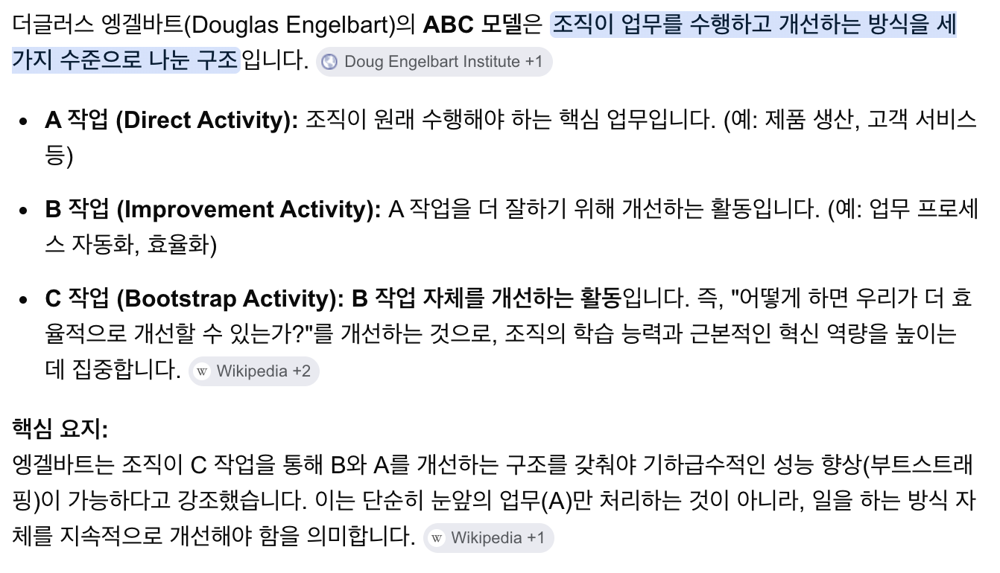

# Slack: mutation testing for user behavior robustness

> Slack thread archive
> Source: https://corcaai.slack.com/archives/C09UJEA7S4R/p1778884665189629?thread_ts=1778739536.178439&channel=C09UJEA7S4R&message_ts=1778884665.189629
> Resolved thread: C09UJEA7S4R:1778739536.178439
> Requested message: 1778884665.189629
> Last updated: 2026-05-17 07:11

---

**KANG Kyu-young** · 2026-05-14 15:18

CAPS 메모. 피드백 루프를 닫는다/완결시킨다(closing the loop). 왜? 다음 세 가지를 하기 위함:

• Self-healing: 오류를 스스로 고친다.
• Self-evolving: 기능/성능 등이 스스로 좋아진다.
• Self-growing: 매출/사용자 등을 스스로 넓혀간다.

---

**BAE Hwidong** · 2026-05-14 20:15

퇴근하며 휘갈겨봅니다

• 프로그램의 가치는 사용자가 정한다
• 사용자는 피드백을 잘 주지 않는다. 자동으로 피드백을 모으자
• 어떻게 사용자를 늘리지? 셀프 그로잉 어떻게 하지? 홍보? 광고? 뭘 홍보할지 어떻게 알지?
• GA로 사용자가 많이 클릭한 것, 퍼널에서 많이 전환시킨 것 알 수 있음. 그들의 인류통계학적 분포나 기기 등 정보도 알 수 있음. 즉 어떤 특징을 가진 사람들이 언제 무엇에 많이 반응하는지 알 수 있음
• 이 정보를 에이전트에게 주면 사람들이 실제로 가치를 느낀 (물론 이것도 가설임) 특정 피처를 강조한 광고 소재를 만들 수 있지 않을까? 당연히 광고 성과도 모두 에이전트가 본다
• 나아가 유사한 조건을 가졌지만 아직 전환되지않은 사람들에게 피처 플래깅을 해주거나, 그냥 제품 자체를 변형시켜 반응이 어떻게 달라지는지 볼 수 있음
• 이걸 하려면 제품이 이러한 변형/플래깅하기 좋은 구조로 구현되어야 함 (테스터빌리티가 높은 제품과도 유사할듯)
• 그리고 실제로 광고를 돌리거나 변형 제품을 배포하지 않고, 네모트론이나 기존 로그를 이용해 에이전트가 사람 역할을 해서 시뮬레이션할 수 있음. 유저 적을 때 콜드스타트 문제 완화. 꿈꾸듯, 과거로 돌아가 이때 이런 문구였다면? 이런 UI였다면 전환 어떻게 됐을까? 보기

---

**BAE Hwidong** · 2026-05-14 20:22

캡스에서 인간의 역할은? 캡스는 인간을 루프에서 빼내기만 하는가? 캡스가 인간을 더 증강시킬 방법은? 캡스와 H-LAM/T 와의 연결점은 뭘까?

이제 다시 걸으면서 생각해보자

---

**BAE Hwidong** · 2026-05-14 20:32

• 캡스는 어떤 관점에서는 ABC 중 B라고 볼 수 있다
• 에이전트는 인간과 같다
• 특정 제품이라는 맥락 없이 캡스를 생각하는 게 어렵다
• 특정 제품에 대한 캡스를 돌리는 과정에서, 캡스를 운영하는 인간(1), 캡스를 실행하는 에이전트(2), 캡스 그 자체(3)가 랭귀지 아티팩트 메소돌로지 차원에서 모두 점점 더 증강될 수 있게 하려면? 사실 그중 하나가 셀프 이볼빙일 수도 있는데, 셀프 이볼빙 메커니즘 자체가 이볼빙 될 수 있을까?

---

**BAE Hwidong** · 2026-05-14 20:36

• 증강이 뭐지? 잘한다는 건 뭐지? 기준이 필요. 퍼포먼스와 마스터리. 둘다 중요하지만 후자가 전이가 더 잘된다고 했던 기억이 남
• 에이전트가, 내가, 캡스 자체가 갈수록 더 나아지고 있음을 어떻게 평가하나?
• 평가 기준이 먼저일까 행동 설계가 먼저일까? 닭과 달걀 같은 느낌

---

**CHUNG Younghyun** · 2026-05-15 10:54

캡스는 어떤 관점에서는 ABC 중 B라고 볼 수 있다
-> ABC 가 뭐에요?

---

**CHUNG Younghyun** · 2026-05-15 10:55

CAPS 고찰 감사합니다! 이거 잘 발전시키면 좋을 것 같아요.

---

**BAE Hwidong** · 2026-05-15 12:25

아 ABC 는 이겁니다!

📎 **Attachments**
- 

---

**CHUNG Younghyun** · 2026-05-15 12:26

왠지 김창준 님이 항상 강조하시는 그거 같습니다

---

**KANG Kyu-young** · 2026-05-15 13:10

훗날 CAPS로 자라날 씨앗들, 작은 구성 요소들을 모아보면 좋겠습니다.

• 에이전트에 잘 맞는 소스 코드 품질 관리 도구들(정적 타입 분석, 온갖 린터 설정, 단위 테스트, specdown 기반 통합 테스트, 비동기 뮤테이션 테스트 등)
• 오픈컬러에서 시작되어 확장될 디자인 검증기
• 제품이 스스로의 소스코드, 운영 로그, GA 로그(유입 채널 및 컨버전 등)를 볼 수 있고 이를 바탕으로 스스로 고치고, 스스로 개선하고, 스스로 성장하기
• 좀 더 발전된 형태의 꿈(과거 기록을 보고 메모리 consolidation 하는 수준을 넘어서기. 예: 과거의 환경을 실제로 재현하여 리플레이하는 꿈, 메모리 consolidation에 국한되지 않고 프롬프트/스킬/코드를 개선하는 꿈 등)
• ...
하나하나가 큰 일이고 많은 시행착오가 필요할테지만요.

---

**BAE Hwidong** · 2026-05-16 07:34

Build 에 해당하는 것들, Measure 에, Learn 에 해당하는 걸로 그룹핑해보면 아직 부족한 것들이 더 눈에 띌 수도 있겠네요. 근데 이제 그룹핑 -> 나무 -> 지배적 폭정 이 자연스레 떠오르고 경계심이 생기는 걸 보니 제가 많이 규며든 것 같습니다 ㅋㅋ

---

**BAE Hwidong** · 2026-05-16 07:37

메모:
• 현재의 뮤테이션 테스트는 코드의 강건함을 테스트한다. 유저 행동에 대한 대응의 강건함은? 멍키 테스트 같은 게 있었던 것 같기도 하고. 이상한 값 넣어본다거나. 
• 크릴이 하는 일도 유사한 면이 있다. 가능한 모든 동작을 해보는 거. 
• 이거 관련 용어나 연구 찾아보고 싶은데 @Ceal 도와줘 $cexit

---

**Ceal** · 2026-05-16 07:37

좋은 키워드 묶음은 이쪽이에요.  가장 가까운 용어 - Monkey testing: 랜덤/반무작위 사용자 입력, 클릭, 이벤트를 넣어 앱이 깨지는지 보는 테스트 - Fuzz testing / fuzzing: 이상한 값, 경계값, 무작위 입력을 넣어 취약점·크래시를 찾는 테스트 - Property-based testing: “항상 성립해야 하는 성질”을 정하고 다양한 입력을 자동 생성해 검증 - Model-based testing: 사용자의 가능한 상태 전이/행동 모델을 만들고 경로를 생성해 테스트 - Exploratory testing: 사람이 제품을 탐색하면서 예상 밖 행동/흐름을 찾는 테스트 - Chaos engineering: 운영 환경에서 일부러 장애/불안정성을 주입해 시스템 강건함을 보는 접근  유저 행동 강건함 쪽으로 더 가까운 표현 - User behavior robustness testing - Interaction fuzzing - UI fuzzing / GUI fuzzing - Event sequence testing - Combinatorial interaction testing - Adversarial user testing - Behavioral testing for interactive systems - End-user error resilience / misuse testing  크릴/CAPS 맥락에 붙이면 좋을 프레이밍 - 코드 뮤테이션 테스트: “코드가 조금 바뀌어도 테스트가 잡아내는가?” - 유저 행동 뮤테이션 테스트: “사용자의 행동이 이상하게 변형되어도 제품/에이전트가 견디는가?” - 에이전트식 탐색: “가능한 행동 공간을 돌아다니며 실패·기회·학습 신호를 찾는가?”  임시 이름으로는 Behavior Mutation Testing 또는 User-Action Fuzzing이 꽤 괜찮아 보여요.   조금 더 연구 냄새 나는 이름은 Model-based Interaction Fuzzing 쪽이고요.  찾아볼 검색어는 이렇게 시작하면 좋겠습니다.  "GUI fuzzing" user interaction testing "model based testing" user behavior "property based testing" UI "monkey testing" mobile app robustness "interaction fuzzing" software testing "event sequence testing" GUI "adversarial testing" user behavior "combinatorial interaction testing" UI  제 감각으로는 지금 메모의 중심은 “코드의 변형”이 아니라 “행동 시퀀스의 변형”을 테스트하는 방법론 같아요.   그래서 출발점은 GUI fuzzing + model-based testing + property-based testing 조합이 좋아 보입니다.

---

**BAE Hwidong** · 2026-05-16 07:38

$ceal:exit

---

**Ceal** · 2026-05-16 07:38

이 thread는 종료되었습니다. 다시 열릴 때까지 더 이상 응답하지 않습니다.
